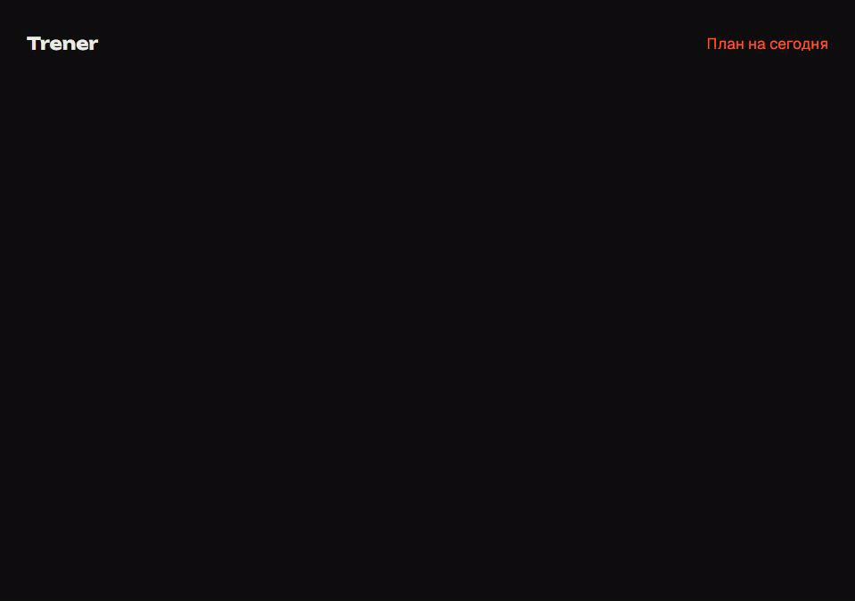

# Trener

Домашние тренировки на каждый день для Windows и macOS. Восемь недель занятий, 34 упражнения с анимациями Remotion, таймер подходов, история тренировок и дневник питания. Интерфейс на русском.



## Возможности

- План дня с разминкой, основной частью и заминкой. Шесть дней движения и воскресенье для подвижности; недели 4 и 8 снижают нагрузку.
- Каталог упражнений: техника, частые ошибки, дыхание и варианты сложности. Персонаж показывает движение и траектории суставов, работающие мышцы подсвечены красным.
- Плеер с подходами, отдыхом и звуковыми сигналами: два коротких сигнала отсчёта и третий, отдельный, на конце подхода. Три уровня нагрузки.
- Голосовые команды без интернета: «стоп», «продолжить», «готово», «дальше», «назад», «ещё» (+15 с отдыха), «начать». Включаются в плеере (значок микрофона) или в «Прогрессе». Распознавание идёт на компьютере ([Vosk](https://alphacephei.com/vosk/), маленькая русская модель), звук никуда не отправляется.
- Календарь тренировок, серия занятий и отдельный учёт заходов.
- Оценка калорий по Mifflin–St Jeor, цели и БЖУ. Дневник еды по датам с небольшой базой продуктов.
- Перетаскиваемый виджет с планом дня и серией. Установленное приложение запускается вместе с системой тихо, только виджетом на рабочем столе. В трее можно скрыть виджет, отключить режим поверх окон и автозапуск.

## Запуск из исходников

Нужен Node.js 22.13+ и npm.

```sh
npm ci
npm run dev
```

Первый `npm run dev` или `npm run build` скачивает голосовую модель (~46 МБ) в `public/models/`, в git её нет.

Для работы только в браузере: `npm run web`. Настройки трея доступны в Electron.

## Сборка

```sh
npm run typecheck
node electron/verify-data.mjs
npm run build
npm run start
npm run dist
```

Установщики попадут в `release/`: NSIS для Windows x64 и DMG для macOS Intel / Apple Silicon. GitHub Actions собирает обе платформы и сохраняет артефакты. Тег `v*` создаёт черновик релиза с установщиками. Без сертификатов сборки не подписаны; macOS может потребовать разрешить запуск в настройках безопасности.

Закрытие основного окна оставляет приложение в трее. Чтобы завершить его, выберите «Выйти» в меню трея. Автозапуск включается только в установленной сборке, по вашему выбору.

## Данные и расчёты

Приложение хранит историю и питание в localStorage на устройстве; настройки виджета хранятся в папке данных Electron. Аккаунт и сервер не нужны. Основное окно и виджет используют одну страницу и синхронизируют историю через событие `storage`.

Калории: `10 × вес (кг) + 6,25 × рост (см) − 5 × возраст + 5` для мужчин, последний член `−161` для женщин. Оценку расхода умножаем на выбранную активность, затем меняем на −15% или +10% для цели. БЖУ распределяем как 25 / 30 / 45% энергии. Это ориентир для взрослых, а значения продуктов приблизительные. [Оригинальная работа Mifflin и соавторов](https://pubmed.ncbi.nlm.nih.gov/2305711/).

Начните с лёгкого уровня и комфортной амплитуды. При боли остановитесь; стул для упражнений должен быть устойчивым и стоять у стены. План коротких домашних занятий можно дополнять прогулками: [CDC рекомендует взрослым 150 минут умеренной активности и минимум два силовых дня в неделю](https://www.cdc.gov/physical-activity-basics/guidelines/adults.html).

## Промо

```sh
node promo/render-screens.mjs
npx remotion render promo/index.tsx TrenerPromo promo/trener.mp4
npx remotion render promo/index.tsx TrenerPromo promo/trener.gif --codec=gif --every-nth-frame=3 --scale=0.75
```

Снимки в `promo/screens/` рендерятся из компонентов приложения с демонстрационной историей в отдельной среде Remotion. Личные данные приложения не используются.

## Стек и лицензия

Electron, React, TypeScript, Vite, Remotion, Motion, Phosphor. Дизайн и токены описаны в [DESIGN.md](DESIGN.md). Код проекта: [MIT](LICENSE). Remotion и другие зависимости распространяются на собственных условиях.
